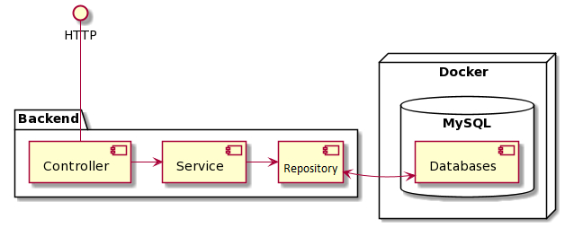
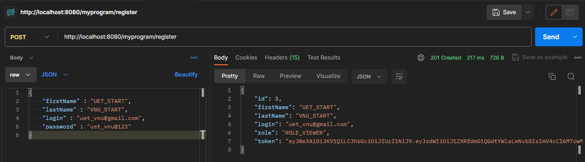
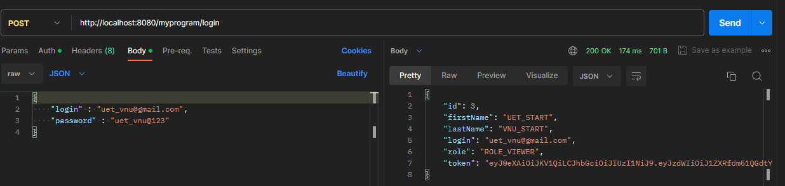

# UETCourseProgram_Web
Project helps students in UET to find subjects that need to study in semester.
## Frontend - ReactJS.
 My partner used my project to create a web interface following the [link](https://github.com/ndtuananh04/UET-PROGRAM-FRONTEND).
## Backend - Spring 
Server side components of the web application are using Java and Spring Framework with MySQL and Hibernate.

__Technologies__
 - Maven - dependency management and building
 - JUni5 & Jupiter - Testing
 - Lombok - constructor and getter/setter generation with annotations
 - Hibernate - Data Access and Object Relational Mapping
 - Spring Boot - Dependency Injection and Web Controllers
 - Swagger UI
 - Spring Security
 - Spring Session
 - RESTful API
 - User authentication (Token) + register
 ## Architecture



The server can be used via HTTP protocol. 
The Controller is reliable for handling HTTP requests. 
Controller maps Java functions into URL Paths with specific methods (GET, POST, PUT, etc).
Controller can parse the Query String, Request Body and pass their content to the Java Method.
The result type also can be converted into JSON format. 
Input and Output JSON Messages should be represented as Data Transfer Objects within the Controller due to network performance and information hiding. 

Controller is also liable for validation of input.
Server-side validation is mandatory.
Valid requests are forwarded to the corresponding Service. 

Service implements the business logic. 
Service definition and implementation are usually separated. 
Business logic can be arbitrary complex (or simple). 
You may perform calculations or complex checking here. 
Service relies on Data Access Objects to data storage. 

Data Access Objects are interfaces which defines the so called CRUD methods. 
CRUD stands for create (INSERT), read (SELECT), update (UPDATE) and delete (DELETE) words. 
Although traditional relational databases are used behind the DAO we can hide any kind or storage behind them. 
So you can store data in File System or any kind of NoSQL solution, such as MongoDB or Redis. 

MySQL is used to store data in the current example. 

_Note: Stop your MySQL server if you have installed it._

## Project Structure

The project structure is based on the Separation of Concerns principle.
Five major packages are defined which are commonly used. 
This packages a fixed, but the structure can be extended if necessary. 
If you are using a 3rd party web application / service then you should add an _adapter_ package as well. 
The purpose of these packages are detailed below. 

### CommonEntity
The _model_ package contains the domain classes (entity) of the project. 
These classes represent object in your system, and they are designed according to the Object Oriented Principles. 
You can use collections, exceptions, inheritance, encapsulation, abstract classes, etc.
Model classes can have their own validation logic. 

_Common Mistakes:_
 - Entity classes are not equal to DB Tables. 
### WebParent/WebBackend 

#### Service
The _service_ package contains the interface and the implementation of the services of the system. 
These services hide the functionality of the software, and they use the _model_ objects.
The services are usually presented as Use-Cases in UML. 
According to the Dependenci Inversion principle the interface should be defined first. 
Then you should add the implementation. 

#### Repository 
The _repository_ package separates storage from business logic, which design simple . 
A repository class is usually an interface which defines the CRUD (_Create_, _Read_, _Update_, _Delete_) methods.
Although usually relational database is used, the Repository does not depend on RDBMS or any other technology. 
You can defined a general Repository and have an implementation for MySQL and another for MongoDB. 
The interface hides these technical details. 

#### Controller

The _controller_ package contains the Controllers and the DTOs (Data Transfer Object).
Controller provides end points for services and it is liable for validation and data conversion.
Controllers are documented with Swagger which provides a web interface on the /api/swagger-ui.html path.
The Controller should validate its inputs because the user input cannot be trusted.
Frontend validation is for the users but the endpoint can be called from anywhere.
If the request is valid then the controller invokes the corresponding service.
The response is also converted into DTO and sent back with the HTTP response.
Exceptions are wrapped and handled by the controller as well.

#### DTO
Data Transfer Objects are used to wrap model classes, hide sensitive information and decrease network traffic.
DTO differs from model objects in several ways.
DTO should have _no arg constructor_, public _getter/setter_ methods for serialization, while these would violate information hiding in the model.
DTO is created to be used in HTTP Requests while model classes are designed according to OOP principles.
DTOs are basicly data structures while _model_ classes have methods, behavior.
DataTransferObjects often named as _Request_ and _Response_ based on their purpose.

#### Config 
Although many of the Beans are instantiated autmaticly by Spring Framework some Beans requires configuration.
Your own Bean, Service, Controller etc. would not require configuartion probably. 
On the other hand, some libraries and modules have to be configured such as Swagger or Spring Security.

#### Mapper 
Use a mapper to transform a DTO (data transfer object) to an entity or vice versa.

### Security

Connection to MYSQL :
Path : "src/main/resources/application.properties"
```bash

server.servlet.context-path=/myprogram
spring.datasource.url=jdbc:mysql://localhost:<your_port>/uetprogram  
spring.datasource.username= <your_username>
spring.datasource.password= <your_password>
```

This setup assumes that anybody can access your website, 
but only specific features are meant to be accessed for authenticated users.

If you wish to force everything to be only accessible by authenticated users, uncomment the following lines
in `SecurityConfig.java` (com/futuresubject/admin/config/security/SecurityConfig.java):

              .authorizeHttpRequests((requests) -> requests
                        .requestMatchers(HttpMethod.POST, "/api/v1/login", "/api/v1/register").permitAll()
                        .requestMatchers("/v3/api-docs",
                                "/v3/api-docs/**",
                                "/v3/api-docs.yaml",
                                "/configuration/ui",
                                "/swagger-resources",
                                "/swagger-resources/**",
                                "/configuration/security",
                                "/swagger-ui.html",
                                "/swagger-ui/**",
                                "/webjars/**").permitAll()
                        .anyRequest().authenticated());
		
By doing so, any request to the API will redirect you to the default [login page](#login) except for:
 
| Method |     Path  | Justification |
|:------:|:---------:|:-------------:|
| POST   | /register |   Register    |
| POST   | /login    |    Login      |

### Sample:

**Register**

```bash

curl --location 'http://localhost:8080/myprogram/register' \
--header 'Content-Type: application/json' \
--data-raw '{
    "firstName" : "UET_START",
    "lastName" : "VNU_START",
    "login" : "uet_vnu@gmail.com",
    "password" : "uet_vnu@123"
}'

```



**Login**

```bash

curl --location 'http://localhost:8080/myprogram/login' \
--header 'Content-Type: application/json' \
--data-raw '{
    "login" : "uet_vnu@gmail.com",
    "password" : "uet_vnu@123"
}'

```


After that, the server will return a key token which helps you access to api basing on your roleType.

### Swagger UI
| Method |       Path       | Justification |
|:------:|:----------------:|:-------------:|
| GET    | /swagger-ui.html |   Swagger UI  |


 
 
 
 
 
 
 ---
